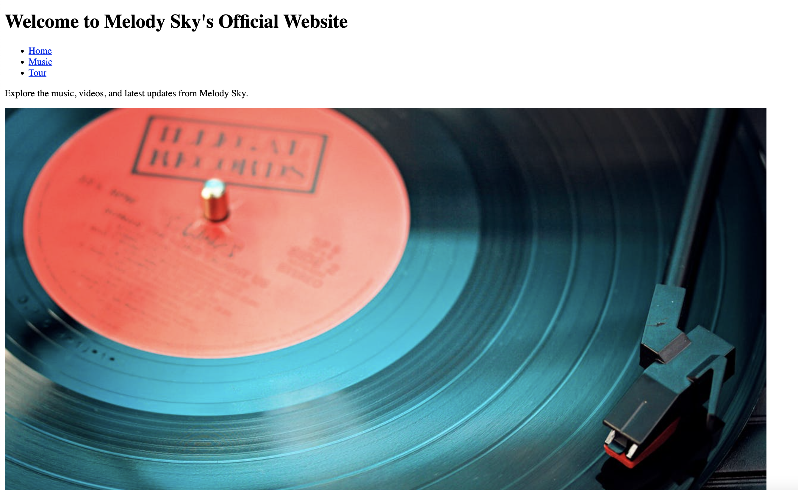

# Melody Sky - Links, Images, Text and More

## Description 📄
In this lab, we will create the basic structure of a website for musician Melody Sky. You will create a well structured HTML document that will include a navigation bar and an unordered list.

---

## Acceptance Criteria 📋
1. **File Navigation:** Navigate to index.html.
2. **Boilerplate Generation:** Use shortcuts to generate HTML boilerplate.
3. **Title Insertion:** Use the given title for the document.
4. **Header, Paragraph, and List Tags Insertion:** Insert appropriate header tags, paragraph tags, and unordered list tags to create a navbar.

---

## ToDo list ✅
**Attention**: When you complete a task, put an `x` in the middle of the brackets to mark it off your ToDo list.

1. [ ] Navigate to the `index.html` file.
2. [ ] In line 1, type an exclamation point, wait to see the prompt, then hit `enter`.
3. [ ] When you have your boilerplate code, in the `head` element, locate the `title` element and enter `Melody Sky`.
4. [ ] Inside the `body` tag, create a header with the text: `Welcome to Melody Sky's Official Website`.
5. [ ] Create a navbar using an unordered list with links to `Home`, `Music`, and `Tour`.
6. [ ] Add a paragraph with the text: `Explore the music, videos, and latest updates from Melody Sky.`
7. [ ] Download a relevant image and place it in the `assets/images` directory. Place that image on under the `
` tag.

🎊 **Great job! You've completed the basic structure for Melody Sky's website.** 🎊

---
© All rights reserved to ThriveDX

